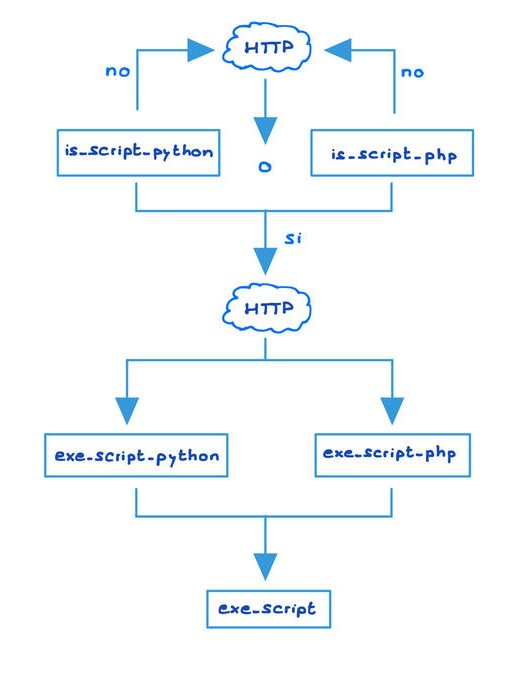
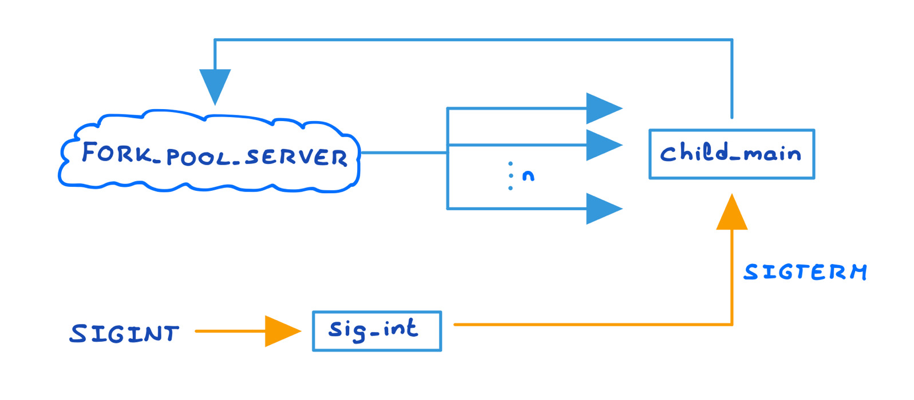
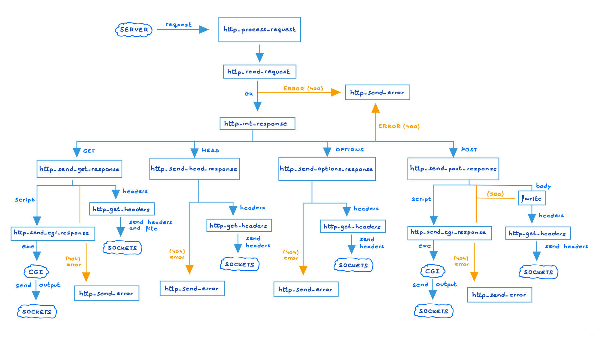
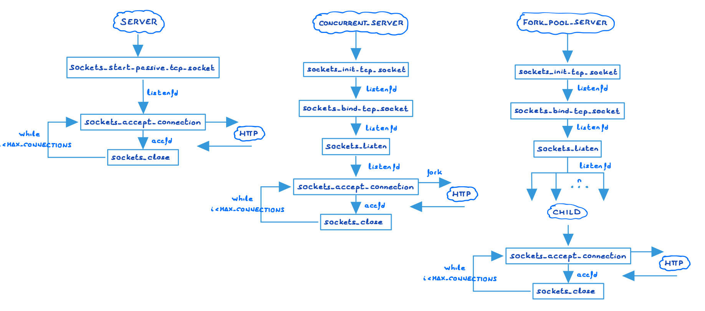

## cgi

Este módulo se encarga de la ejecución de scripts en python o php. En líneas generales, podríamos dividir las funciones pertenecientes a él en tres grupos:
1. is\_script\_python y is\_script_php se encargan de comprobar si un path dado corresponde con un script en python o php, respectivamente, comprobando su extensión.
2. exe_script, función privada, se encarga de la ejecución de un script. En primer lugar, recupera los argumentos, que en el caso de un GET están concatenados a la URL y en el caso de un POST están en el cuerpo de la petición. Entonces, el proceso principal crea un hijo que lanza la ejecución del script. Para pasarle los argumentos, se crean dos tuberías, y se redirige la salida de la primera a stdout, y la entrada de la segunda a stdin. Así, el padre escribe los argumentos por su extremo de la segunda, y llegan a la entrada estándar del script que se está ejecutando. Este, a su vez, escribirá los resultados en su extremo de la primera tubería de forma que el padre los lea desde la salida estándar.
3. exe\_script\_python y exe\_script\_php llaman a la función general exe_script indicando el nombre del intérprete que debe ir al principio de la llamada que ejecuta el script (python3 o php). De esta forma, la función general ejecuta el script con una llamada al sistema consistente en el nombre del intérprete y el path.

## child

Este módulo se encarga de la gestionar los procesos hijo creados para el pool del servidor. Controla dos acciones principales:
1. child_main es la función principal a realizar por un proceso del pool. En un bucle infinito, el hijo acepta conexiones por el puerto indicado, procesa las peticiones http que recibe, manda la respuesta que corresponda y cierra las conexiones. Este bucle se detendrá cuando se reciba una señal SIGINT por parte del proceso padre.
2. sig_int es el manejador de la señal SIGINT. Cuando esta es recibida, se envía la señal SIGTERM a todos los hijos para acabar con ellos, se espera que acaben y se retorna al proceso principal.

## http

Este módulo se encarga de procesar y responder a las peticiones http. En líneas generales, podríamos dividir las funciones pertenecientes a él en tres grupos:
1. http\_process_request es la función principal de este módulo. Recibe una petición, la parsea, comprueba el método al que corresponde, y llama a la función correspondiente a dicho método para que genere una respuesta http, o devuelve error si la petición está mal formada.
2. http\_send\_\[method]_response genera la respuesta http correspondiente a la petición según cuál sea el método empleado (get, post, head, options, cgi).
3. http\_get\_header_\[...] recogen los distintos elementos que forman una cabecera para irlos añadiendo de uno en uno a la respuesta http. Estos elementos son fecha, última modificación, nombre del servidor, tipo de contenido y longitud. La función http\_get\_headers los va recogiendo uno a uno para formar la cabecera de la respuesta.
4. http\_init_response comprueba, antes de crear una respuesta http, que la petición recibida tiene las cabeceras básicas o si por el contrario está mal formada. Si este es el caso, se devolverá el error 400-Bad Request. Si no, se creará la respuesta http y se procederá según el método.
5. http\_read_request, como su nombre indica, lee del socket correspondiente una petición.
6. http\_get\_error_doc devuelve el path al archivo html asociado a un error, en concreto a los errores 400 y 404. De esta forma, dicho archivo puede ser mostrado además del mensaje de error, informando al cliente de una forma más visual de los que consideramos que serán los errores que se produzcan con mayor frecuencia.

## sockets

Este módulo se encarga de gestionar los sockets para el servidor. Concretamente, realiza 6 acciones principales:
1. Abrir un socket tcp, encapsulando una llamada a socket().
2. Registrar un socket tcp en un puerto dado, encapsulando una llamada a bind().
3. Dejar un socket a la escucha, listo para recibir peticiones, encapsulando una llamada a listen().
4. Aceptar una conexión o esperar a recibir una, encapsulando una llamada a accept().
5. Cerrar un socket, encapsulando una llamada a close().
6. Enviar información a través del socket, encapsulando una llamada a send().

